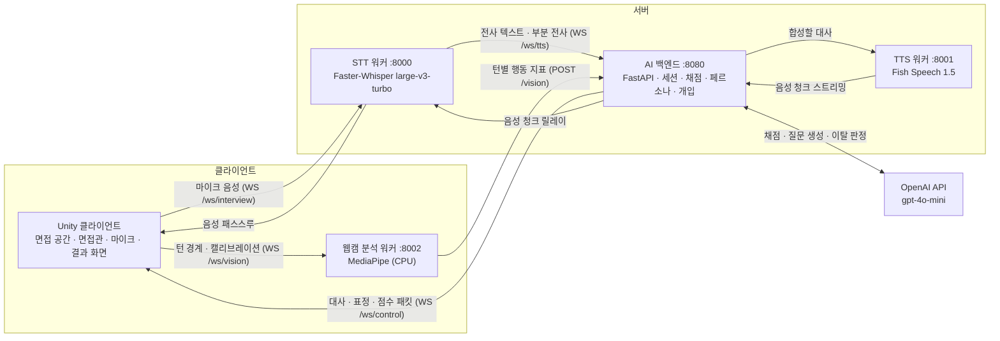
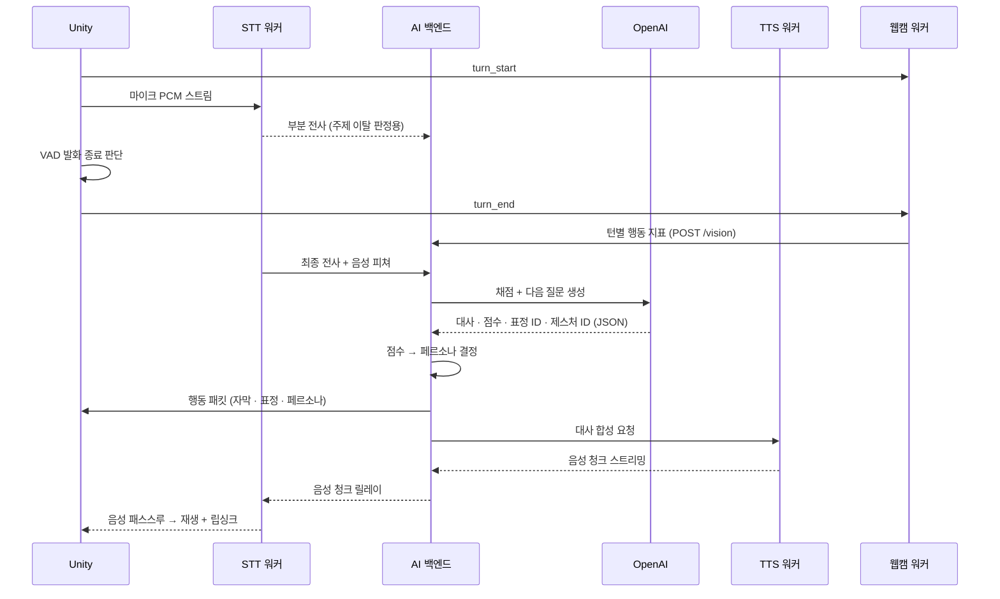

# VRoom — Virtual Human 에이전트를 활용한 가상 면접 플랫폼

> 2026년 전기 부산대학교 정보컴퓨터공학부 졸업과제 **09조 VRoom**
> 지도교수: 이명호

VRoom은 PC 환경의 3차원 면접 공간에서 Virtual Human 면접관과 음성으로 대화하는 **멀티모달 기반 실시간 AI 면접 시뮬레이터**입니다.
답변 점수에 따라 면접관의 태도(페르소나)와 표정이 실시간으로 바뀌고, 부정 페르소나 상태에서는 면접관이 주제 이탈·과다 응답·무응답에 **먼저 말을 끊고 개입**합니다.
면접이 끝나면 음성 6개 항목과 웹캠 기반 행동 4개 항목을 종합한 피드백 리포트를 제공합니다.

---

## 목차

1. [프로젝트 배경](#1-프로젝트-배경)
2. [개발 목표](#2-개발-목표)
3. [시스템 설계](#3-시스템-설계)
4. [개발 결과](#4-개발-결과)
5. [설치 및 실행 방법](#5-설치-및-실행-방법)
6. [소개 자료 및 시연 영상](#6-소개-자료-및-시연-영상)
7. [팀 구성](#7-팀-구성)
8. [참고 문헌 및 출처](#8-참고-문헌-및-출처)

---

## 1. 프로젝트 배경

### 1.1. 국내외 시장 현황 및 문제점

채용 시장은 코로나 이후 침체가 이어지고 있으며, 구인배수는 2022년 6월 0.78에서 2026년 3월 0.36으로 떨어져 채용 문턱이 절반 수준으로 좁아졌습니다. 구직자들은 특히 실전 경험을 쌓기 어려운 면접 단계에서 큰 부담을 느끼고, 이를 보완하기 위해 다양한 AI 모의 면접 서비스가 등장했습니다.

그러나 기존 서비스는 대부분 텍스트·음성 질의응답이나 웹캠 영상 기록 수준에 머물러 있으며, 다음과 같은 한계가 있습니다.

| 문제 | 설명 |
|:--|:--|
| 완전한 턴제 구조 | 사용자가 말을 모두 마쳐야만 면접관이 반응하므로, 실제 면접의 끼어들기나 즉각적인 반응을 경험할 수 없습니다. |
| 고정된 면접관 태도 | 답변 내용과 관계없이 면접관의 표정과 행동이 세션 내내 같아 실전 긴장감이 없습니다. |
| 획일화된 질문 시나리오 | 사전 정의된 공통 질문 위주라 다양한 직무와 채용 환경에 대응하지 못합니다. |
| 비언어적 행동 피드백 부재 | 답변 내용만 평가하고 시선, 자세, 표정, 손 사용 같은 비언어적 행동은 피드백하지 않습니다. |

### 1.2. 필요성과 기대효과

면접은 답변 내용뿐 아니라 전달 방식, 시선·자세, 예상하지 못한 질문과 압박에 대한 대응까지 함께 평가됩니다. 따라서 실제 면접장의 공간감과 면접관과의 상호작용을 재현하고, 답변 내용과 비언어적 행동을 함께 분석하는 훈련 환경이 필요합니다.

VRoom은 다음과 같은 효과를 기대합니다.

- **실전 감각 훈련**: 답변에 따라 태도가 바뀌고 필요하면 말을 끊는 면접관을 통해, 실제 면접의 긴장감과 압박 상황을 반복적으로 연습할 수 있습니다.
- **객관적인 자기 진단**: 음성(음량, 속도, 답변 길이, 추임새, 답변 품질, 반응 시간)과 행동(시선, 자세, 제스처, 표정)을 정량화한 10개 항목 피드백으로 자신의 약점을 구체적으로 확인할 수 있습니다.
- **직무 맞춤형 연습**: 지원 기업, 직무, 이력서를 바탕으로 질문과 꼬리질문이 동적으로 생성되어, 자신이 준비하는 채용 환경에 맞춰 연습할 수 있습니다.

---

## 2. 개발 목표

### 2.1. 목표 및 세부 내용

| # | 목표 | 세부 내용 |
|:--:|:--|:--|
| 1 | 3차원 면접 환경 | Unity로 실제 면접장과 유사한 PC 기반 3D 면접 공간과 Virtual Human 면접관을 구현하고, 합성 음성과 입 모양을 실시간으로 동기화합니다. |
| 2 | 직무 맞춤형 질문 생성 | 기업·직무·이력서 정보를 바탕으로 LLM이 답변을 채점하고 다음 질문과 꼬리질문을 생성합니다. |
| 3 | 가변 페르소나 | 답변 점수를 실시간으로 채점해 면접관의 태도를 긍정·중립·부정으로 전환하고, 표정과 동작에 반영합니다. |
| 4 | 능동 개입(끼어들기) | 부정 페르소나 상태에서 주제 이탈, 과다 응답, 무응답을 감지하면 면접관이 먼저 개입합니다. |
| 5 | 멀티모달 분석 | 음성 6개 항목과 웹캠 기반 행동 4개 항목을 정량화해 답변 내용과 함께 종합 채점합니다. |

**면접 시나리오**

```
자기소개 → 기술 질문 → 꼬리질문 1 → 꼬리질문 2 → 인성 질문 → 마무리 → 종합 피드백
```

| 단계 | 내용 |
|:--|:--|
| 자기소개 | 기업·직무·기술 스택을 추출해 면접관 페르소나를 구성합니다. |
| 기술 질문 | 직무 핵심 역량을 검증합니다. |
| 꼬리질문 1·2 | 직전 답변을 바탕으로 논리와 근거를 파고듭니다. |
| 인성 질문 | 협업, 갈등 해결 능력을 확인합니다. |
| 마무리 | 마지막 발언 기회를 준 뒤 10개 항목 종합 피드백 리포트를 생성합니다. |

**가변 페르소나 규칙**

LLM이 직전 답변을 0~100점으로 채점하면, 백엔드가 점수 구간에 따라 페르소나를 결정합니다. 페르소나를 LLM에 맡기지 않고 코드 규칙으로 정해, 같은 점수에는 항상 같은 반응이 나오도록 했습니다.

| 페르소나 | 점수 | 면접관 반응 |
|:--|:--|:--|
| 긍정 | 70점 이상 | 긍정·경청 표정 |
| 중립 | 40 ~ 69점 | 중립적인 경청 반응 |
| 부정 | 40점 미만 | 압박 표정, **개입 가능 상태** |

**능동 개입 유형**

| 유형 | 발동 조건 | 판정 주체 | 면접관 행동 |
|:--|:--|:--|:--|
| 주제 이탈형 (Type A) | 답변이 질문 주제에서 벗어남 | 부분 전사를 LLM이 의미 판정 | 같은 질문에 대한 재답변을 요구 |
| 과다 응답형 (Type B) | 답변이 90초를 초과 | Unity 로컬 타이머 | 답변을 끊고 다음 질문으로 진행 |
| 무응답형 (Type B) | 질문 후 15초간 무응답 | Unity 로컬 타이머 | 다음 질문으로 진행 |

개입은 기술 질문, 꼬리질문 1·2, 인성 질문 단계에서만 판정하며, 단계당 1회·세션당 최대 3회로 제한합니다.

### 2.2. 기존 서비스 대비 차별성

| 구분 | 기존 모의 면접 서비스 | VRoom |
|:--|:--|:--|
| 대화 주도권 | 사용자 발화가 끝난 뒤에만 반응 | 답변 도중 면접관이 먼저 개입 |
| 면접관 태도 | 세션 내내 고정 | 답변 점수에 따라 실시간 가변 |
| 질문 구성 | 사전 정의된 공통 질문 | 기업·직무·이력서 기반 동적 생성 |
| 평가 범위 | 답변 내용 | 답변 내용 + 음성 특성 + 비언어적 행동 |
| 면접 환경 | 텍스트·웹캠 화면 | 3D 면접 공간과 립싱크되는 Virtual Human 면접관 |

대화 에이전트의 개입(barge-in) 연구는 대부분 **사용자가 에이전트의 말을 끊는** 방향에 집중되어 있고, 에이전트가 사용자를 끊는 기능은 오히려 의도적으로 배제되어 왔습니다. VRoom은 실시간 답변 채점과 행동 신호를 근거로 **면접관이 능동적으로 개입해 압박 강도를 조절하는 교육용 가상 면접관**을 제시합니다.

이 차별점의 효용을 검증하기 위해, 동일한 시스템에서 기능을 켜고 끄는 방식으로 세 가지 조건을 비교하는 실험을 설계했습니다.

| 조건 | 페르소나 | 개입 |
|:--|:--|:--|
| A (정적 턴제) | 고정 | 비활성 |
| B (가변 페르소나) | 점수에 따라 전이 | 비활성 |
| C (가변 + 능동 개입) | 점수에 따라 전이 | 활성 |

### 2.3. 사회적 가치 도입 계획

- **취업 준비 격차 완화**: 유료 면접 컨설팅이나 스터디 없이도 원하는 시간에 반복해서 실전형 모의 면접을 경험할 수 있어, 경제적·지역적 여건에 따른 면접 준비 격차를 줄이는 데 기여합니다.
- **개인정보 보호를 고려한 설계**: 음성 인식(STT)과 음성 합성(TTS)은 로컬 GPU 워커에서 처리하고, 웹캠 영상은 분석 워커가 로컬에서 처리한 뒤 턴당 약 1KB의 수치 지표만 백엔드로 전송합니다. 영상 자체는 외부로 전송하거나 저장하지 않습니다.
- **재사용 가능한 모듈 구조**: STT, TTS, 영상 분석, 백엔드를 독립 워커로 분리해 다른 음성·분석 모델로 교체할 수 있으므로, 발표 연습이나 상담 훈련 등 다른 대화형 교육 도구로 확장할 수 있습니다.

---

## 3. 시스템 설계

### 3.1. 시스템 구성도

VRoom은 **Unity 클라이언트, AI 백엔드, STT 워커, TTS 워커, 웹캠 분석 워커** 5개 구성 요소로 이루어집니다. GPU가 필요한 STT·TTS는 Docker 컨테이너로 분리하고, 웹캠 분석은 CPU만으로 동작하도록 구성했습니다.



| 구성 요소 | 소스 경로 | 포트 | 주요 역할 |
|:--|:--|:--:|:--|
| Unity 클라이언트 | [`src/VRoom_Interview_Simulator`](src/VRoom_Interview_Simulator) | — | 3D 면접 공간, 설정·결과 화면, 면접관 연출(표정·립싱크), 마이크 입력과 VAD, 음성 재생 |
| AI 백엔드 | [`src/VRoom_Backend`](src/VRoom_Backend) | 8080 | 세션·면접 단계 관리, LLM 호출, 점수·페르소나 결정, 개입 판정, 피드백 생성 |
| STT 워커 | [`src/verbal_process/stt-worker-docker`](src/verbal_process/stt-worker-docker) | 8000 | 부분·최종 전사, 문장 종료 판단, 음성 피쳐 추출 |
| TTS 워커 | [`src/verbal_process/tts-worker-docker`](src/verbal_process/tts-worker-docker) | 8001 | 면접관 대사를 음성으로 합성해 스트리밍 |
| 웹캠 분석 워커 | [`src/vision_process`](src/vision_process) | 8002 | 웹캠을 직접 열어 턴별 시선·자세·손 사용·표정 지표를 집계 |

**오디오 데이터 형식**

| 구분 | 형식 |
|:--|:--|
| 마이크 입력 (Unity → STT) | 16 kHz, Mono, 16-bit Integer PCM (발화 시작 시 WAV 헤더 포함) |
| 음성 출력 (TTS → Unity) | 44.1 kHz, Mono, 32-bit Float PCM |

### 3.2. 사용 기술

| 분류 | 기술 |
|:--|:--|
| 클라이언트 | Unity 6 (6000.4.7f1), C#, URP 17.4, uLipSync, Animation Rigging 1.4.1, TextMeshPro |
| 면접관 캐릭터 | Character Creator 5, ActorCore, CC/iC Unity Tools |
| 백엔드 | Python 3.10+, FastAPI, Uvicorn, WebSocket, asyncio |
| LLM | OpenAI gpt-4o-mini (정보 추출, 채점, 질문·대사 생성, 주제 이탈 판정) |
| STT | Faster-Whisper (Whisper large-v3-turbo, CTranslate2, CUDA FLOAT16), Silero VAD |
| TTS | Fish Speech 1.5 (zero-shot 보이스 클로닝, 44.1 kHz 스트리밍) |
| 영상 분석 | MediaPipe Face Landmarker, Pose Landmarker (CPU) |
| 실행 환경 | Docker Desktop, WSL2, NVIDIA Container Toolkit, VS Code Dev Containers |
| 분산 실행 (선택) | Tailscale (기기 간 가상 네트워크) |
| 협업 | Git, GitHub |

---

## 4. 개발 결과

### 4.1. 전체 시스템 흐름도

**면접 진행 흐름**

1. 설정 화면에서 기업, 직무, 이력서 정보가 담긴 텍스트 파일을 불러옵니다.
2. 백엔드가 세션을 만들고 첫 질문(자기소개 요청)을 템플릿으로 준비해 음성을 미리 합성합니다.
3. 면접관이 자기소개를 요청하고, 사용자의 답변을 STT로 변환합니다.
4. 백엔드가 답변을 채점하고 기술 질문과 꼬리질문을 순서대로 생성합니다.
5. 답변 점수에 따라 다음 발화의 페르소나와 표정이 결정됩니다.
6. 개입이 활성화된 경우, 대상 단계에서 부정 페르소나일 때 주제 이탈·과다 응답·무응답에 개입합니다.
7. 마무리 발화가 끝나면 음성·영상 피쳐와 대화 기록으로 최종 피드백을 생성해 결과 화면에 표시합니다.

**한 턴의 처리 흐름**



### 4.2. 기능 설명 및 주요 기능 명세서

| 기능 | 입력 | 출력 | 설명 |
|:--|:--|:--|:--|
| 면접 설정 | 면접 정보 txt (`[기업]`, `[직무]`, `[이력서]`, `[조건]`) | 세션 생성, 첫 질문 프리웜 | 파일을 파싱해 백엔드 세션을 준비하고 첫 질문 음성을 미리 합성해 시작 지연을 줄입니다. |
| 음성 입력 · 발화 종료 판단 | 마이크 음성 | 발화 구간 오디오 청크 | Unity VAD가 발화 시작·종료를 판단합니다. STT가 문장 종료를 감지하면 침묵 임계값을 약 3초에서 약 1초로 줄여 응답을 앞당깁니다. |
| 음성 인식 (STT) | 16 kHz PCM | 부분 전사, 최종 전사, 음성 피쳐 | 개입 판정용 부분 전사 경로와 최종 답변 전사 경로를 분리했습니다. |
| 답변 채점 · 질문 생성 | 전사 텍스트, 면접 단계, 대화 기록, 이력서 | 면접관 대사, 점수, 채점 근거, 표정 ID, 제스처 ID | LLM 출력을 단일 JSON 계약으로 제한하고, 파싱 실패 시 재시도와 기본 응답으로 대화 흐름을 유지합니다. |
| 가변 페르소나 | 답변 점수 | 페르소나, 연속 감정값 | 점수 구간으로 페르소나를 정하고, 해당 페르소나에서 허용된 표정·동작만 적용합니다. |
| 능동 개입 | 부분 전사, Unity 타이머 신호 | 컷인 명령, 개입 대사, 후속 질문 | 표정을 바꾸는 컷인과 실제 대사를 분리해, LLM 대사 생성보다 먼저 면접관이 반응합니다. |
| 음성 합성 · 립싱크 | 면접관 대사 | 44.1 kHz 음성 스트림 | Fish Speech로 합성한 음성을 청크 단위로 스트리밍하고, uLipSync로 입 모양을 동기화합니다. |
| 면접관 연출 | 행동 패킷 | Animator 파라미터, BlendShape 가중치 | 감정값은 Animator의 Emotion 축, 음성 재생 여부는 Speaking 축에 반영하고, 표정은 BlendShape 프리셋으로 적용합니다. |
| 웹캠 행동 분석 | 웹캠 영상 (워커 로컬) | 턴별 시선·자세·손 사용·표정 지표 | 개입이 발생한 답변은 TRUNCATED, REACTION, REANSWER 위상으로 나눠 중복 집계를 막습니다. |
| 종합 피드백 | 전체 대화 기록, 음성·영상 피쳐 | 10개 항목 점수(0~10), 단계별 점수, 강점·개선점, 총평 | 웹캠이 연결되지 않았거나 얼굴 검출이 부족하면 음성 항목 중심 결과로 전환합니다. |
| 세션 로그 | 턴별 이벤트 | 세션 CSV·로그 | 대화, 점수, 피쳐, 개입 이력을 기록하며 `tools/summarize_logs.py`로 조건·위상별 집계가 가능합니다. |

**10개 평가 항목**

| 영역 | 항목 |
|:--|:--|
| 행동 (웹캠) | 시선, 자세, 제스처(손 사용), 표정 |
| 음성 | 음량, 발화 속도, 답변 길이, 추임새, 답변 품질, 반응 시간 |

**백엔드 엔드포인트**

| 엔드포인트 | 종류 | 용도 |
|:--|:--|:--|
| `/ws/control` | WebSocket | Unity 제어 채널 (행동 패킷, 컷인, 결과) |
| `/ws/tts` | WebSocket | STT 워커의 전사 텍스트 수신, 음성 릴레이 |
| `/session/prepare` | POST | 세션 준비와 첫 질문 프리웜 |
| `/process` | POST | 텍스트 답변 직접 처리 (디버그용) |
| `/vision` | POST | 웹캠 워커의 턴별 행동 지표 수신 |
| `/health` | GET | 서버 상태 확인 |

### 4.3. 디렉토리 구조

```
capstone-2026-team-09/
├── README.md
├── docs/
│   ├── 01.보고서/                     # 착수 · 중간 · 최종 보고서
│   ├── 02.포스터/                     # 졸업과제 포스터
│   └── 03.발표자료/                   # 발표 자료 (pptx, pdf)
└── src/
    ├── VRoom_Backend/                 # AI 백엔드 (FastAPI, :8080)
    │   ├── app/
    │   │   ├── main.py                # 엔드포인트, WebSocket 허브, 턴 처리
    │   │   ├── session.py             # 세션 상태, 면접 단계 전이, 피드백 계산
    │   │   ├── llm.py                 # OpenAI 호출, 프롬프트, JSON 계약
    │   │   ├── bargein.py             # 개입 게이트와 판정 로직
    │   │   ├── domain.py              # 단계 · 페르소나 · 개입 유형 정의
    │   │   ├── config.py              # 환경 변수와 임계값 설정
    │   │   ├── tts_client.py          # TTS 워커 연결
    │   │   └── session_log.py         # 세션 로그 기록
    │   ├── tools/                     # 로그 집계 · 실험 분석 · 오프라인 검증 스크립트
    │   └── requirements.txt
    ├── VRoom_Interview_Simulator/     # Unity 클라이언트
    │   ├── Assets/
    │   │   ├── Scenes/                # SetupScene, InterviewRoomScene
    │   │   ├── Scripts/
    │   │   │   ├── AudioPipeline/     # 파이프라인 제어, VAD, STT 연결, 음성 재생
    │   │   │   ├── Backend/           # 백엔드 제어 채널, 행동 패킷
    │   │   │   ├── Frontend/          # 설정 · 결과 UI, 면접관 구동 · 표정
    │   │   │   └── Multimodal/        # 웹캠 워커 연결, 턴 경계 전달
    │   │   ├── Models/                # 면접관 캐릭터, 면접실 에셋
    │   │   └── Audio/                 # 개입 템플릿 음성
    │   ├── Packages/
    │   └── ProjectSettings/
    ├── verbal_process/                # 음성 처리 워커 (Docker)
    │   ├── stt-worker-docker/         # STT 워커 (:8000)
    │   ├── tts-worker-docker/         # TTS 워커 (:8001)
    │   └── open_container.ps1
    └── vision_process/                # 웹캠 분석 워커 (:8002)
        ├── server.py                  # FastAPI 서버, 카메라 펌프
        ├── analyzer.py                # 프레임별 지표 추출
        ├── aggregator.py              # 턴 단위 집계
        └── models/                    # MediaPipe 모델 파일
```

각 모듈의 상세 설명은 하위 폴더의 README를 참고하세요.

### 4.4. 산업체 멘토링 의견 및 반영 사항

- **멘토**: 안종길 책임연구원 (KT)
- **자문 일시 및 방식**: 2026년 8월 6일, 서면 자문 (중간보고서 검토)
- **총평**: 답변 품질에 따라 면접관 태도가 바뀌고 답변 도중 능동적으로 개입하는 기능을 차별화 요소로 제시한 점은 의미 있는 시도로 평가되었습니다. 다만 중간 시점에는 기반 시스템에 비해 핵심 기능의 구현과 검증이 진행 중인 단계이므로, 남은 기간에는 핵심 기능 완성과 시스템 안정화, 실험·평가 설계 보완에 집중할 것을 권고받았습니다.

| 멘토 의견 | 반영 사항 |
|:--|:--|
| XTTS-v2 → Fish Speech 교체, HMD 기반 VR → PC 기반 전환은 구현 가능성과 사용자 경험을 고려한 합리적인 판단임 | 두 결정을 유지했습니다. PC 기반 전환으로 HMD 대신 웹캠으로 행동 데이터를 수집하는 구조를 완성했습니다. |
| 새로운 기능 추가보다 핵심 기능(연속형 페르소나의 표정·제스처 바인딩, 실시간 개입, 웹캠 행동 데이터 수집, 음성·행동 피드백, 실험·평가)의 구현과 통합·안정화에 집중할 것 | 자문 이후 추가 기능 없이 다섯 가지 핵심 기능을 모두 구현해 하나의 면접 흐름으로 통합했습니다. 안정화를 위해 세션 ID·발화 ID로 늦게 도착한 전사가 다른 턴에 섞이지 않도록 하고, LLM 응답 파싱 실패 시 재시도와 기본 응답을 두었으며, 웹캠 워커가 없어도 음성 면접은 계속되도록 했습니다. |
| 실험 일정, 참가자 규모, 평가 절차, 분석 방법의 구체화가 필요함 | 참가자 3명 × 조건 3개(9세션)의 참가자 내 설계로 확정하고, 라틴 방진으로 조건 순서를 균형화했습니다. 조건 간 차이만 비교되도록 모든 조건에서 동일한 답변 프로토콜을 사용했고, 턴별 로그를 조건·위상별로 집계하는 분석 스크립트(`tools/summarize_logs.py`, `tools/analyze_experiment.py`)를 작성해 실험을 수행했습니다. |
| 실시간 개입의 판단 시점과 전체 응답 지연을 줄이는 방법 | 주제 이탈형은 답변 중 생성되는 부분 전사를 LLM이 판정하고(판정 지연 891 ms), 과다 응답·무응답형은 Unity 로컬 타이머가 판정해 최종 전사를 기다리지 않습니다. 개입 시에는 표정을 바꾸는 컷인과 템플릿 개입 대사를 먼저 재생하고 후속 질문은 별도로 생성합니다. 전체 지연은 첫 질문 템플릿화와 서버 준비 단계의 웜업, TTS 청크 스트리밍, 문장 종료 감지 시 침묵 임계값을 약 3초에서 약 1초로 줄이는 방식으로 단축했습니다(4.5절 측정 결과). |
| LLM 평가 결과를 Unity 표정·제스처 애니메이션에 매핑하는 방식 | LLM이 표정까지 임의로 고르면 같은 점수에도 반응이 달라지므로, LLM은 대사·점수·표정 ID·제스처 ID를 단일 JSON으로만 출력하고 페르소나는 백엔드가 점수 구간으로 결정하도록 했습니다. 페르소나별 허용 세트를 벗어난 ID는 보정합니다. Unity는 연속 감정값을 Animator의 Emotion 축에, 음성 재생 여부를 Speaking 축에 반영하되 목표값으로 선형 보간(Lerp)해 태도가 급격히 튀지 않도록 했고, 표정은 표정 ID에 대응하는 BlendShape 프리셋의 목표 가중치로 전환합니다. |
| 웹캠 행동 데이터의 추출 방식과 최종 피드백 반영 방법 | 웹캠 분석 워커가 MediaPipe Face·Pose Landmarker로 영상을 로컬에서 처리해 시선, 자세, 손 사용, 표정 지표를 턴별로 집계하고, 백엔드가 이를 0~10점으로 환산해 10개 평가 항목 중 행동 4개 항목에 반영합니다. 검출 신뢰도가 낮은 턴은 제외하거나 중립 점수를 부여하고, 개입이 발생한 답변은 TRUNCATED, REACTION, REANSWER 위상으로 나누어 분석합니다. |
| 행동 지표와 피드백 효과의 객관적 검증 방법 | 동일 시스템에서 페르소나 전이와 개입만 켜고 끄는 3조건 비교로 변수를 하나씩 통제했습니다. 개입 전후 구간의 고개 움직임과 표정 변화를 정량 비교해, 개입 직후 5초간 고개 움직임이 41% 감소하는 것을 확인했습니다. 다만 표본 규모가 작아 통계적 유의성 확보는 향후 과제로 남겼습니다(4.5절 한계점). |
| 핵심 통합 기능이 특정 구성원에게 집중되어 있으므로 역할 분담이 필요함 | 모듈 간 인터페이스를 명확히 분리했습니다. 웹캠 워커는 원시 지표 추출만, 점수 환산은 백엔드가 담당하도록 책임을 나눴고, 각 모듈 레포에 독립 실행·검증 절차를 문서화해 팀원 누구나 자신의 PC에서 모듈을 실행하고 디버깅할 수 있도록 했습니다. |

### 4.5. 성능 측정 및 실험 결과

**음성 처리 지연** (동일 면접 대본 4개 세션, 개입 턴을 제외한 정상 답변 22개 턴)

| 측정 항목 | 평균 (초) | 중앙값 (초) |
|:--|:--:|:--:|
| STT 처리 지연 | 1.68 | 1.01 |
| LLM 응답 완료 | 1.77 | 1.67 |
| TTS 첫 청크 생성 | 2.34 | 2.30 |
| VAD 종료 판단 지연 | 1.65 | 1.03 |
| VAD 종료 판단 → Unity 재생 시작 | 5.99 | 6.00 |
| 마지막 음성 프레임 → Unity 재생 시작 | 7.64 | 7.63 |

VAD 종료 판단 지연의 평균이 중앙값보다 큰 이유는, 문장 종료가 감지된 턴에는 약 1초, 그렇지 않은 턴에는 기본값 약 3초의 침묵 임계값이 적용되기 때문입니다.

**3조건 비교 실험** (참가자 3명 × 조건 3개 = 9세션, 라틴 방진으로 조건 순서 균형화)

- 조건 C에서 개입이 총 4회 발동했습니다 (주제 이탈형 3회, 과다 응답형 1회).
- 주제 이탈 LLM 판정 지연은 891 ms였습니다.
- 개입 4건 모두 개입 직후 5초 동안 고개 움직임과 표정 변화가 감소했으며, 고개 움직임은 41% 줄었습니다. 주제 이탈형은 재답변 구간에서 개입 전의 88~91% 수준으로 회복했습니다.
- 개입이 발동한 참가자 2명은 조건이 강해질수록 움직임이 줄었지만, 개입이 발동하지 않은 1명은 그렇지 않았습니다.

**한계점**

- 3명 × 3조건 규모로는 통계적 유의성을 확보하기 어렵고, 개입을 유도하기 위해 정해진 답변 프로토콜을 사용해 완전한 자연 발화가 아닙니다.
- 직무 전문 용어의 STT 오인식이 관찰되었고, 채점이 전사 텍스트에 의존해 점수 하락으로 이어질 수 있습니다.
- 부정 페르소나 기준(40점 미만)이 LLM 채점 분포와 겹쳐, 조건 C 3세션 중 1세션에서는 개입이 발동하지 않았습니다.
- 면접관 대사의 어조 일관성, 질문 패턴 반복, 제스처 리소스 부족, 조명·카메라 위치에 따른 웹캠 분석 정확도 차이가 남아 있습니다.

향후 참가자 확대와 자유 발화 조건 추가, 직무별 용어 사전 주입, 연속 감정 강도 기반 개입 게이팅, 페르소나별 제스처와 억양 보강을 계획하고 있습니다.

---

## 5. 설치 및 실행 방법

### 5.1. 설치절차 및 실행 방법

#### 준비 사항

| 항목 | 요구사항 |
|:--|:--|
| OS | Windows 10/11 |
| GPU | NVIDIA GPU (STT·TTS 워커용, 두 워커 합계 VRAM 약 6GB 이상 권장) |
| 소프트웨어 | Docker Desktop + WSL2, NVIDIA Container Toolkit, VS Code (Dev Containers 확장), Python 3.10 이상, Unity Hub + Unity 6000.4.7f1 |
| 외부 API | OpenAI API 키 |
| 장치 | 마이크, 웹캠 (어깨까지 화면에 들어오도록 배치) |

**모델 파일 배치** (용량 문제로 레포지토리에 포함하지 않음)

| 워커 | 경로 |
|:--|:--|
| STT | `src/verbal_process/stt-worker-docker/model/whisper/` (Faster-Whisper large-v3-turbo CTranslate2 모델) |
| TTS | `src/verbal_process/tts-worker-docker/model/fish-speech-1.5/` (Fish Speech 1.5 모델) |

TTS 레퍼런스 음성은 `tts-worker-docker/speaker.mp3`에 포함되어 있습니다.

#### 포트

| 서비스 | 포트 | 주소 |
|:--|:--:|:--|
| STT 워커 | 8000 | `ws://127.0.0.1:8000/ws/interview` |
| TTS 워커 | 8001 | `ws://127.0.0.1:8001/ws/tts` |
| 웹캠 분석 워커 | 8002 | `ws://127.0.0.1:8002/ws/vision` |
| AI 백엔드 | 8080 | `ws://127.0.0.1:8080/ws/control` |

#### 환경 변수 설정

`src/VRoom_Backend/.env`

```ini
LLM_PROVIDER=openai
OPENAI_API_KEY=your_openai_api_key
OPENAI_MODEL=gpt-4o-mini
TTS_WORKER_URL=http://localhost:8001/process
TTS_WS_URL=ws://localhost:8001/ws/tts
HOST=0.0.0.0
PORT=8080
PROXY_AUDIO_TO_STT=false
SKIP_TTS=false
TEMPLATE_FIRST_QUESTION=true
WARMUP_LLM_ON_PREPARE=true
BARGEIN_FORCE_NEGATIVE=false
SESSION_LOG_DIR=logs
```

`src/verbal_process/stt-worker-docker/.env`

```ini
TTS_WORKER_URL=http://host.docker.internal:8080/process
TTS_WORKER_WS_URL=ws://host.docker.internal:8080/ws/tts
CHECKPOINT_ENABLED=true
CHECKPOINT_BACKEND_ENABLED=true
```

`src/verbal_process/tts-worker-docker/.env`

```ini
LLM_PROVIDER=openai
OPENAI_API_KEY=your_openai_api_key
OPENAI_MODEL=gpt-4o-mini
TTS_ONLY=true
REFERENCE_DIALOGUE = 안녕하세요, 오늘 면접에 참여해주셔서 감사합니다. 편안한 마음으로 답변해주시면 됩니다.먼저 간단한 자기소개 부탁드립니다. 본인의 강점과 그동안의 경험을 자유롭게 말씀해주세요. 혹시 이전 직장에서 3년 정도 근무하셨다고 들었는데, 맞나요? 그 기간 동안 가장 기억에 남는 프로젝트는 무엇이었나요? 예상치 못한 문제가 생겼을 때, 어떻게 대처하셨는지도 궁금합니다. 와, 정말 흥미로운 경험이네요! 팀원들과 협업 툴을 활용해서 KPI를 관리하셨다니, 구체적으로 어떤 방식이었는지 더 설명해주시겠어요? 동료와 의견 충돌이 있었을 때는 어떻게 해결하셨나요? 갈등 상황에서도 침착하게 대처하는 능력이 중요하다고 생각합니다. 마지막으로, 입사 후 1년 안에 이루고 싶은 목표가 있다면 말씀해주시겠어요? 그리고 저희 회사에 지원하게 된 결정적인 이유도 함께 듣고 싶습니다. 오늘 답변 정말 잘 들었습니다. 마지막으로 저희에게 궁금하신 점이나 하고 싶은 말씀 있으신가요?
SYSTEM_PROMPT = 이모티콘이나 불릿 포인트(*, -, 숫자로 매기는 리스트 등)의 사용을 절대 금지합니다. 실제 대화하듯이 자연스러운 구어체 평문 텍스트로만 대답해 주세요.
```

`src/vision_process/.env`

```ini
BACKEND_URL=http://127.0.0.1:8080
CAM_INDEX=0
CAM_BACKEND=DSHOW
CAM_FPS=10
SHOW_PREVIEW=0
```

#### 실행 순서

반드시 **TTS → STT → 웹캠 워커 → 백엔드 → Unity** 순서로 실행합니다.

**① TTS · STT 워커 (Docker)**

`src/verbal_process`에서 `open_container.ps1`을 실행하거나, `stt-worker-docker`와 `tts-worker-docker` 폴더를 각각 VS Code로 열고 명령 팔레트에서 **Dev Containers: Reopen in Container**를 실행합니다. 컨테이너가 준비되면 각 터미널에서 워커를 실행합니다.

```bash
# tts-worker-docker 컨테이너 (모델 로딩과 웜업 완료 메시지를 확인한 뒤 다음 단계로)
python tts-worker.py

# stt-worker-docker 컨테이너
python stt-worker.py
```

**② 웹캠 분석 워커**

```powershell
cd src\vision_process
python -m venv .venv
.venv\Scripts\activate
pip install mediapipe fastapi "uvicorn[standard]" httpx python-dotenv
python -u -m uvicorn server:app --host 0.0.0.0 --port 8002
```

`http://127.0.0.1:8002/health`에서 워커와 카메라 상태를 확인합니다.

**③ AI 백엔드**

```powershell
cd src\VRoom_Backend
python -m venv .venv
.venv\Scripts\activate
pip install -r requirements.txt
python -u -m uvicorn app.main:app --host 0.0.0.0 --port 8080
```

`http://127.0.0.1:8080/health`에서 서버 상태를 확인합니다.

**④ Unity 클라이언트**

1. Unity Hub에서 **Add → Add project from disk**로 `src/VRoom_Interview_Simulator`를 추가하고 Unity 6000.4.7f1로 엽니다. 처음 열 때는 Library 생성으로 시간이 걸립니다.
2. 서비스 주소가 기본값과 다르면 Inspector에서 다음 값을 수정합니다.
   - `BackendControlClient.backendUrl` → `ws://<백엔드 IP>:8080/ws/control`
   - `STTManager` 의 WS URL → `ws://<STT IP>:8000/ws/interview`
   - `VisionStreamClient` 의 WS URL → `ws://<웹캠 워커 IP>:8002/ws/vision`
3. `Assets/Scenes/SetupScene.unity`를 열고 Play합니다.
4. 아래 형식의 면접 정보 txt 파일을 불러온 뒤 면접을 시작합니다.

```text
[기업]
지원 기업명

[직무]
지원 직무

[이력서]
이력서 내용

[조건]
C
```

`[조건]`에는 실험 조건 A(페르소나 고정, 개입 없음), B(가변 페르소나), C(가변 페르소나 + 능동 개입) 중 하나를 적습니다. 일반 사용 시에는 모든 기능이 켜진 **C**를 사용합니다.

> 여러 PC에 나누어 실행하는 경우(예: GPU 데스크탑에서 STT·TTS·백엔드, 노트북에서 Unity·웹캠 워커)에는 각 `.env`와 Unity Inspector의 주소를 해당 PC의 IP로 바꾸고, 방화벽에서 8000·8001·8002·8080 포트를 허용합니다. 서로 다른 네트워크라면 Tailscale로 묶는 구성을 권장하며, 자세한 절차는 [`src/VRoom_Backend/README.md`](src/VRoom_Backend/README.md)에 정리되어 있습니다.

### 5.2. 오류 발생 시 해결 방법

| 증상 | 원인 | 해결 방법 |
|:--|:--|:--|
| 다른 PC에서 STT·TTS 워커(8000/8001)에 접속되지 않음 | Windows의 Docker Desktop은 컨테이너 포트를 `127.0.0.1`에만 바인딩 | 관리자 PowerShell에서 `netsh interface portproxy add v4tov4 listenport=8000 listenaddress=0.0.0.0 connectport=8000 connectaddress=127.0.0.1` (8001도 동일) 또는 WSL2 mirrored 네트워킹 사용 |
| 백엔드·워커 로그의 한글이 깨지거나 인코딩 오류로 종료 | PowerShell 콘솔 인코딩 | 실행 전 `[Console]::OutputEncoding = [Text.Encoding]::UTF8` 실행 |
| `pip install uvicorn[standard]` 실패 | PowerShell이 대괄호를 와일드카드로 해석 | `"uvicorn[standard]"`처럼 따옴표로 감싸기 |
| 행동 점수 중 자세·제스처가 0점 | 어깨나 손이 카메라 화면 밖에 있음 | 상반신과 손이 프레임에 들어오도록 웹캠 위치 조정 |
| 결과 화면에 행동 항목이 표시되지 않음 | 웹캠 워커 미연결 또는 얼굴 검출 부족 | `http://127.0.0.1:8002/health`로 카메라 상태 확인. 워커가 없어도 음성 항목 결과는 정상 제공됨 |
| Unity 첫 실행 시 `.meta ... can't be found, and has been created` 등 경고 다수 | Git이 빈 폴더를 저장하지 않아 생기는 임포트 경고 | 정상 동작이며 무시해도 됨 |
| Windows에서 clone 시 경로 길이 오류 | Unity 에셋 경로가 260자 제한을 초과 | `git config --global core.longpaths true` 설정 후 짧은 경로(예: `C:\capstone`)에 clone |

---

## 6. 소개 자료 및 시연 영상

### 6.1. 프로젝트 소개 자료

- 발표 자료: [PDF](<docs/03.발표자료/2026전기_발표자료_09_VRoom_Virtual Human 에이전트를 활용한 가상 면접 플랫폼.pdf>) · [PPTX](<docs/03.발표자료/2026전기_발표자료_09_VRoom_Virtual Human 에이전트를 활용한 가상 면접 플랫폼.pptx>)
- 포스터: [PDF](<docs/02.포스터/2026전기_포스터_09_VRoom_Virtual Human 에이전트를 활용한 가상 면접 플랫폼.pdf>)
- 보고서: [착수보고서](<docs/01.보고서/2026전기_착수보고서_09_VRoom_Virtual Human 에이전트를 활용한 가상 면접 플랫폼.pdf>) · [중간보고서](<docs/01.보고서/2026전기_중간보고서_09_VRoom_Virtual Human 에이전트를 활용한 가상 면접 플랫폼.pdf>) · [최종보고서](<docs/01.보고서/2026전기_최종보고서_09_VRoom_Virtual Human 에이전트를 활용한 가상 면접 플랫폼.pdf>)

### 6.2. 시연 영상

[](https://www.youtube.com/watch?v={동영상 ID})

---

## 7. 팀 구성

### 7.1. 팀원별 소개 및 역할 분담

| 이름 | 학번 | 이메일 | 역할 |
|:--|:--|:--|:--|
| 유재명 (팀장) | 202155575 | ryujm3410@pusan.ac.kr | Unity 클라이언트(면접 공간, 면접관 모델, UI, 립싱크, 개입 연출), FastAPI 백엔드와 WebSocket 통신, 웹캠 행동 분석 워커, 전체 모듈 통합 및 실험 설계·분석 |
| 강동요 | 202055503 | krgdy@pusan.ac.kr | STT·TTS 워커 구축, 오디오 파이프라인, 음성 활동 감지(VAD)와 음성 피쳐 추출 |
| 강저릭 어요솝드 | 202355503 | oganzorig12@pusan.ac.kr | LLM 프롬프트 설계, 면접관 페르소나·대화 로직, 답변 채점과 질문·꼬리질문 생성, 최종 피드백 산출 로직 |

### 7.2. 팀원 별 참여 후기

- **유재명**: (작성 예정)
- **강동요**: (작성 예정)
- **강저릭 어요솝드**: (작성 예정)

---

## 8. 참고 문헌 및 출처

1. Coqui AI. *Coqui TTS: Text-to-Speech toolkit (XTTS-v2)*. https://github.com/coqui-ai/TTS
2. Fish Audio. *Fish Speech*. https://github.com/fishaudio/fish-speech
3. Google. *MediaPipe*. https://github.com/google-ai-edge/mediapipe
4. SYSTRAN. *Faster-Whisper*. https://github.com/SYSTRAN/faster-whisper
5. OpenAI. *Whisper*. https://github.com/openai/whisper
6. Silero Team. *Silero VAD*. https://github.com/snakers4/silero-vad
7. hecomi. *uLipSync*. https://github.com/hecomi/uLipSync
8. OpenAI. *OpenAI API Documentation*. https://platform.openai.com/docs
9. Reallusion. *Character Creator*, *ActorCore*. https://www.reallusion.com
10. soupday. *CC/iC Unity Tools*. https://github.com/soupday
11. FastAPI. https://fastapi.tiangolo.com